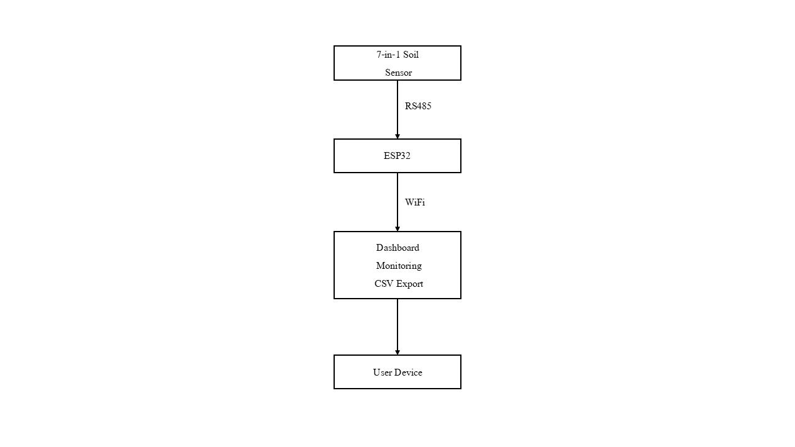
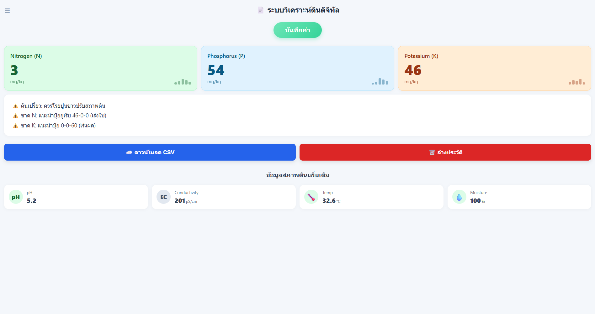
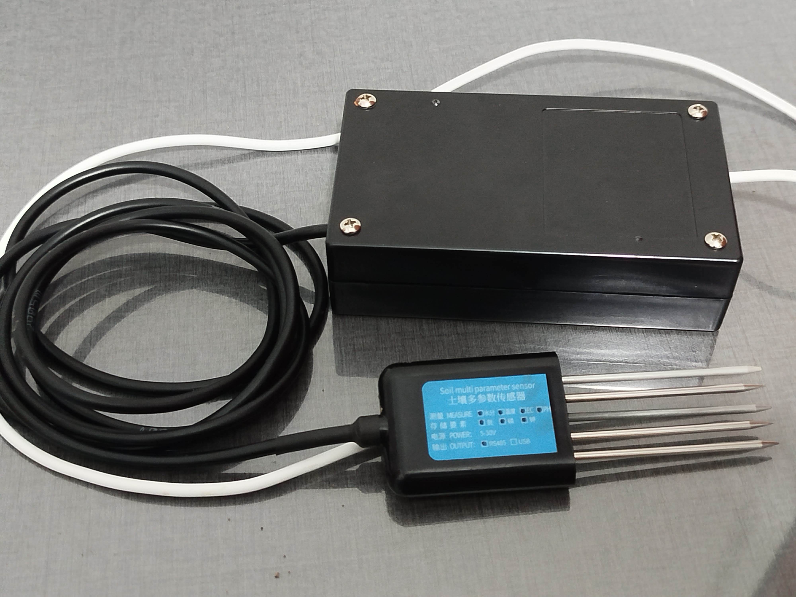

# Smart Soil Monitoring System

Senior Engineering Project

ESP32-based soil monitoring system using RS485 Modbus RTU communication and an embedded web server.

## Features

7-in-1 Soil Parameter Monitoring
Nitrogen (N)
Phosphorus (P)
Potassium (K)
pH
EC
Soil Moisture
Temperature
Embedded Web Server
Captive Portal
Data Logging
CSV Export
Sensor Stability Verification

## System Architecture

## Dashboard

## Hardware Setup

## Hardware Used

ESP32
RS485 Module
7-in-1 Soil Sensor
Buzzer
  
## Development Status
Soil monitoring system completed
Continuing feature improvements and testing
