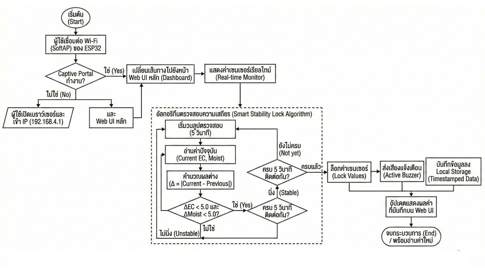
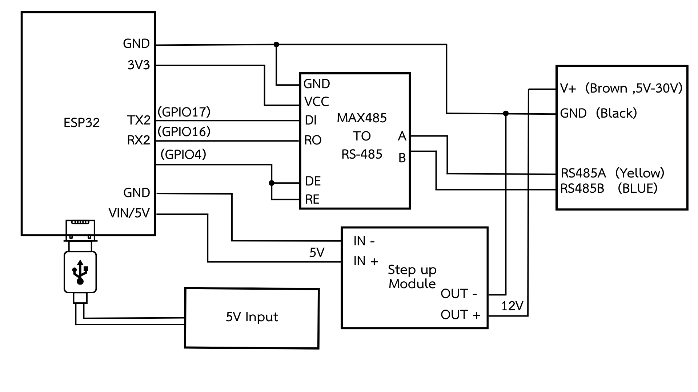

# Smart Soil Monitoring System

Senior Engineering Project

ESP32-based soil monitoring system using RS485 Modbus RTU communication and an embedded web server.

## Features

### 7-in-1 Soil Parameter Monitoring
- Nitrogen (N)
- Phosphorus (P)
- Potassium (K)
- pH
- EC
- Soil Moisture
- Temperature

### System Functions
- Embedded Web Server
- Captive Portal
- Real-time Monitoring
- Data Logging
- CSV Export
- Sensor Stability Verification
- Fertilizer Recommendation
- Crop Selection
  
## System Overview

#### System Workflow

## Hardware Wiring

## Dashboard

## Hardware Setup

## Hardware Used

- ESP32
- MAX485 RS485 Module
- 7-in-1 Soil Sensor
- Buzzer
- DC-DC Step-Up Module

## Communication Protocol

- RS485
- Modbus RTU
- 4800 bps

## System Workflow

1. Read sensor data via RS485 Modbus RTU
2. Process and verify sensor stability
3. Display real-time data on embedded dashboard
4. Evaluate nutrient levels based on selected crop
5. Generate fertilizer recommendations
6. Store measurement records locally
7. Export collected data as CSV

## Source Code

- ESP32 Firmware (Arduino Framework)
- Embedded HTML/CSS/JavaScript Dashboard
- Modbus RTU Communication
- Captive Portal Implementation

## Development Status

✅ Soil monitoring system completed

🔧 Continuing feature improvements and testing
